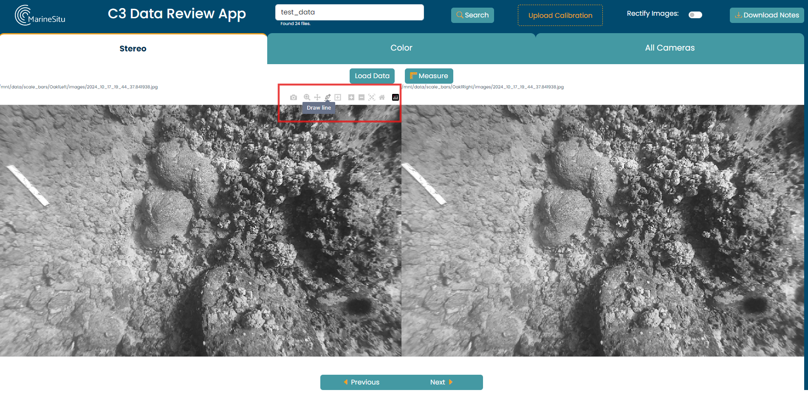
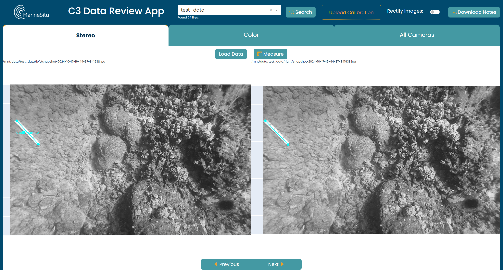
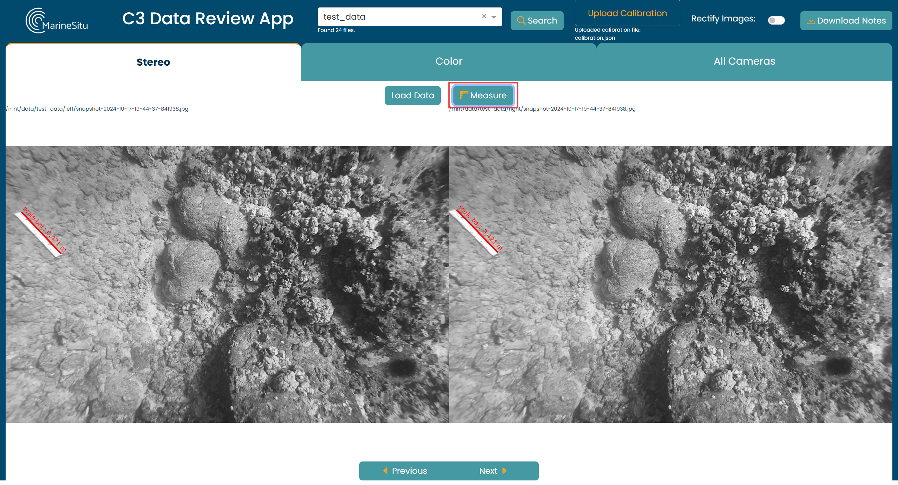
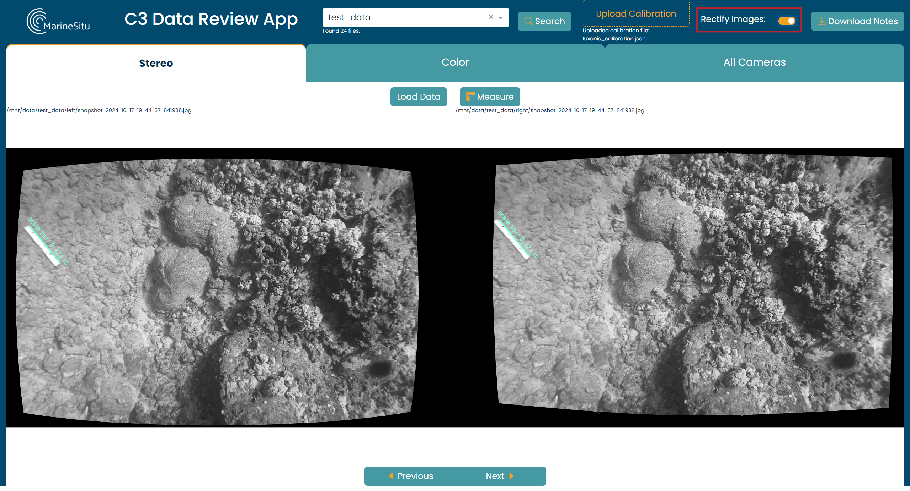
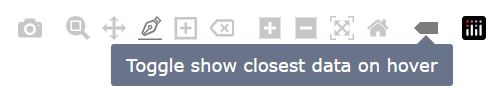
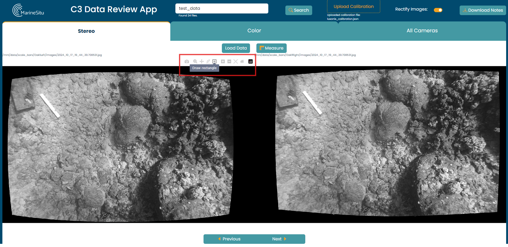
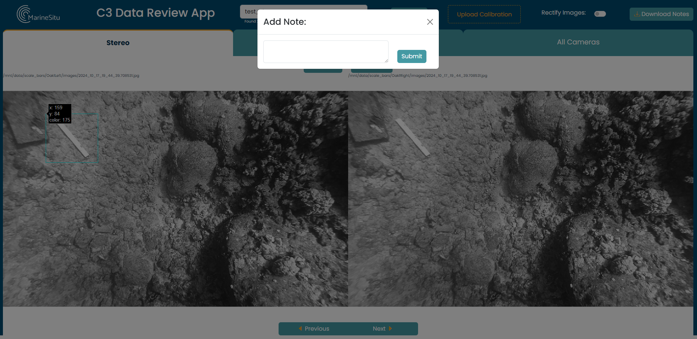
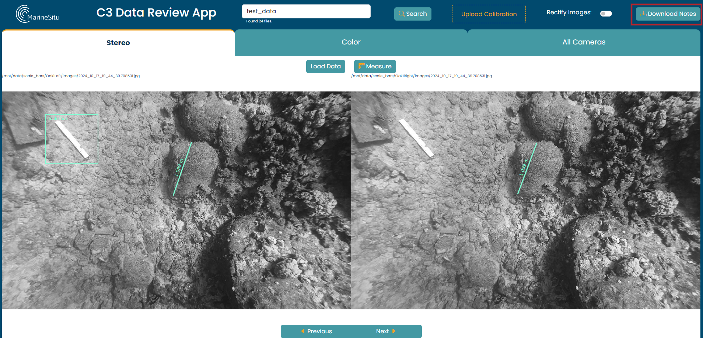

# Annotation and Measurement

The C3 Data Review App offers precise annotation tools to accurately measure and label objects, events, or regions of interest within your MarineSitu datasets. 

## Stereo Size Measurement

To measure an object, first ensure the **Draw Line** tool is selected in the menu at the top left of your image.

Then, on both the left and right stereo images, draw a line across the distance you want to measure. These lines can be edited by selecting clicking the line and dragging the endpoints to a new location. Note: Once the line has been measured, it is no longer editable.

Lines can be deleted by clicking the line, then clicking **Delete Shape** tool in the menu at the top left of your image.

Once you're happy with the location of your line, if you'd like to name or label this line, click the *\<edit name\>* text that should have appeared on your line in the left image and type in your label. Enter or deselect to confirm. This label will be applied to both the left and right lines once measured.

Finally, click **Measure** and your calculated distances will be shown on the lines you drew. These values are also recorded during your session for later download.

Object measurement can be done with the images either rectified or un-rectified, which can be toggled using the **Rectify Images** switch on the top right of the dashboard. When drawing lines with rectification on, horizontal guidelines will appear on the opposite stereo image after a line has been drawn to assist with correspondence.

Note: These calculations rely on the precision of drawing matching lines in the two images, and the accuracy of the calibration. 

To toggle off the hover text that states the pixel location and color values, click the **toggleHover** button on the right in the image menu.

## Bounding Box Style Annotation

To annotate an image, first ensure the **Draw Rectangle** tool is selected in the menu at the top left of your image.

Then on any image, draw a rectangle around the item you want to annotate. A pop-up will appear prompting you to enter a comment or note. Type what you want, submit, and the box will be updated with your text.

The locations and text are also recorded during your session for later download.

## Retrieving your Annotations

As stated before, the measurements and bounding box annotations are recorded during your session. 

Any annotations created in a session will auto-populate on an image when it is viewed in any of the tabs. This prevents unintentional duplicate labeling and provides a visual record.

All annotations and measurements from your session can be downloaded using the **Download Notes** button, which produces a csv output with the annotations aggregated to have one line per image. This stores the image, instrument, location of the annotation, the text, and whether the location refers to rectified points or not.

In a future version, you'll be able to load in annotations from a previous session and continue where you left off.