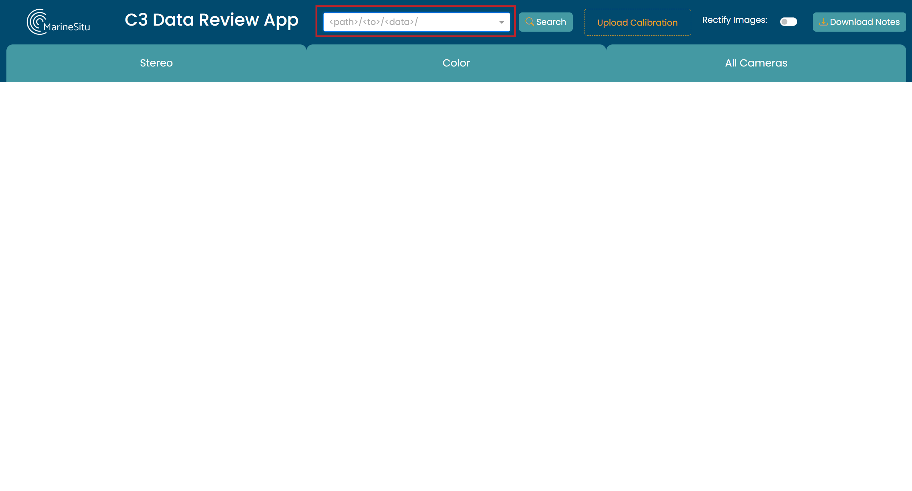
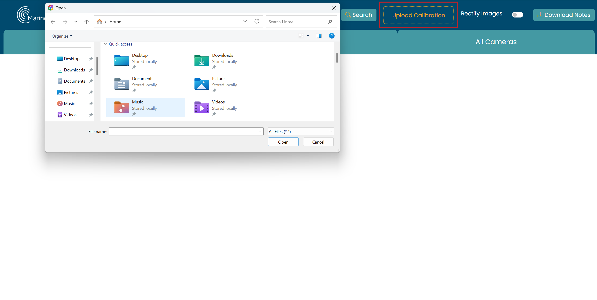
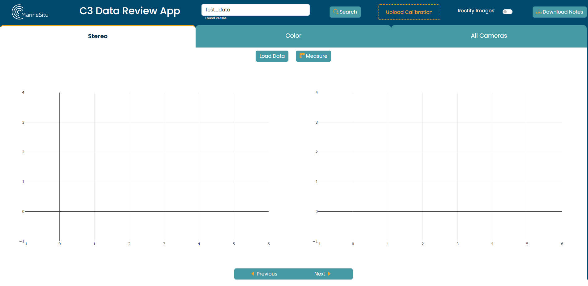
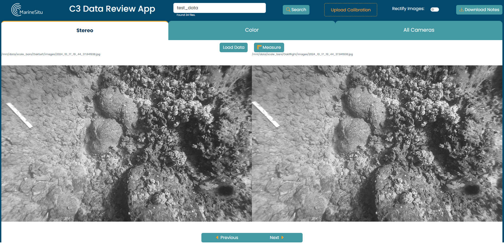

# Quick Start

Here we will walk through the basic usage of the C3 Data Review app including how to install the program, load and view data, add a calibration file, and annotate your first images.

## Installation

C3 Data Review App is open-source and will continually be pushing out new features and changes.

See [Home - Installation](index.md#installation) for installation instructions.

Once the C3 Data Review App is installed, open the program and you will be taken to the C3 Data REview Web Application. The first step is to load in your data.

## Loading Data

Loading data is quite simple. Simply enter the directory of your dataset in the input bar and click **Search**. The app will automatically parse the timestamp information and images associated with each of the two stereo and one rgb camera. If your dataset is large, this make take a few moments to complete.

This process assumes that the image sets are locally available and separated by device (left, center, right). And that either EXIF timestamps are available or the timestamp is simply encoded in the filename by *snapshot-YYYY-MM-DD-HH-MM-SS-MS.jpg*

You should see a small text confirmation when your dataset has loaded.

## Loading a Calibration

Some datasets might have a calibration file already included in the saved directory. In this case - you don't have to do anything, the calibration will automatically be applied. 

If you'd like to replace that calibration with a new file, you can still add one to override the existing.

To add a calibration, you can either drag and drop your file onto the **Upload Calibration** box, or click the box and browse for it in your filesystem.

You should see a small text confirmation of the file that has been uploaded. Note: this process expects a json filetype and in [Luxonis](https://docs.luxonis.com/hardware/platform/depth/calibration/) format.

If a calibration is not loaded and is needed to perform a task, you will be prompted to upload a file.

## Viewing the Dataset

After loading your data, it may seem like nothing has happened. This is because you have to decide which data you want to look at. You'll need to select a tab - *Stereo*, *Color*, or *All*.  

You'll see some placeholder graphs and new controls appear. Click **Load Data** to see your first images.

You can use the **Next** and **Previous** buttons or arrow keys to navigate through your images.

If your images are not timestamp synchronized from all instruments to within 5 ms, a placeholder image will be shown for the missing data.

## Annotating the Dataset

The C3 Data Review App offers two annotation options: 
 
- **Stereo Size Measurement**  
- **Bounding Box Style Annotation**

Stereo size measurement is offered on the stereo images, and the bounding box annotation is available on all images.

These are explained in more detail in [Measuring and Annotating](annotating.md), but below is a quick overview of the methods.

To measure size, you'll draw a matching line on each of the stereo images and click **Measure**.

To annotate, you'll draw a box, and type a comment in the corresponding pop-up.
